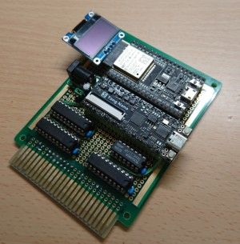
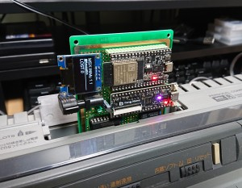
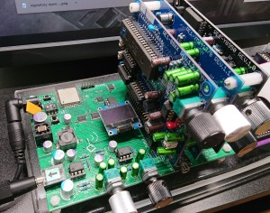

# MSX WiMuse
Harumakkin

## ■ What is this
MSX本体のスロットに接続してOPLLとPSGへのI/Oアクセス出力を読み取り、それを無線LANで飛ばしてRE:birthモジュールで音楽や効果音を楽しむためのものです。
WiMuseはMSX本体の音声出力ではなくMSX-MusicをRE:birthを使って楽しむための基板です。RE:birthモジュールは、WiFi PLL Mother に載せて使用します。
WiMuseはWiFi PLL Motherと無線LANで通信します。プロトコルはWiFi PLL Motherで規定されています。
WiMuseは、MSXにMSX-Music、MSX-Audioに類する機能を組み込むための仕組みではありません。MSX側には内臓音源かFM-PACなどのFM音源、FS-CA1やAUDIOWAVE等のY8950音源が必要です。

製作例 

使用例 

RE:birth modules and WiFi PLL Mother 

- RE:birthモジュール：https://ym2203.com/rebirth/|
- WiFi PLL Mother：https://nekokohouse.sakura.ne.jp/tools/|

## ■ 対応しているRE:birth モジュール
|モジュール名|音源|MSX側I/Oアドレス|
|:-|:-|:-|
|RE1-YM2413|FM音源OPLL|7Ch-7Dh|
|RE1-89XX|PSG音源|A0h-A1h|
|RE1-Y8950|FM音源Y8950|C0h-C1h|

RE1-Y8950は、ゼビウス～ファードラウト伝説～で確認しました。
無線LANを使用しているため、SPFM Light、RESPFMには対応していません。

## ■ WiMuseの製作
- 部品表、回路図、実装例の実装例を参考に製作します。
- TangNano は WiMuseTN フォルダを参照してください。
- ESP32 は WiMuseESP フォルダを参照してください。

## ■ 使い方
WiMuseがアクセスポイント(SoftAP機能)になり、WiFi PLL Motherがそれに接続します。
WiFi PLL Motherには、事前に、SSIDとパスワードを設定しておきます。
SSID: "MSXWIMUSE1"、PASSWORD: "123456MSX"
別のSSIDとパスワードを使用したい場合はESP32のソースコードを修正する必要があります。
また、別のアクセスポイント経由で接続した場合も、ソースコードを修正してください。
WiFi PLL Motherには、SLOT0からRE1-YM2413、RE1-89XX、RE1-Y8950で実装してください。
無線LANに問題なければ、MSX側にWiMuseを接続し、電源を入れればWiFi PLL Mother側から
音がなるはずです。

以上

